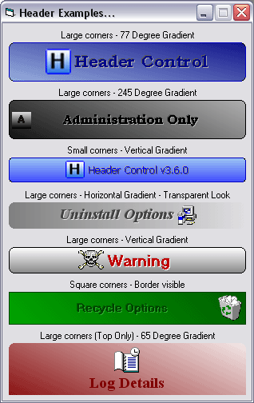



## Header UserControl 360 \- API Version \(Update 8th Nov 04\)

### Description

360 Degree gradient added. Thanks for all the previous comments/votes!
 
### More Info
 

             |
---                |---
**Submitted On**   |2004-06-06 20:26:02
**By**             |[Peter\.](https://github.com/Planet-Source-Code/PSCIndex/blob/master/ByAuthor/peter.md)
**Level**          |Advanced
**User Rating**    |4.9 (214 globes from 44 users)
**Compatibility**  |VB 6\.0
**Category**       |[Custom Controls/ Forms/  Menus](https://github.com/Planet-Source-Code/PSCIndex/blob/master/ByCategory/custom-controls-forms-menus__1-4.md)
**World**          |[Visual Basic](https://github.com/Planet-Source-Code/PSCIndex/blob/master/ByWorld/visual-basic.md)
**Archive File**   |[Header\_Use1815861182004\.zip](https://github.com/Planet-Source-Code/peter-header-usercontrol-360-api-version-update-8th-nov-04__1-53508/archive/master.zip)

